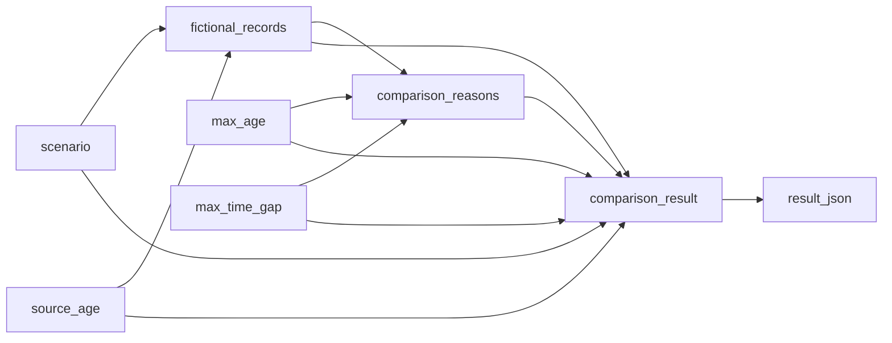

# Preserve uncertainty in a Hamilton dataflow

Two prices can look comparable while describing different contracts or different
moments in time. This small [Apache Hamilton](https://hamilton.apache.org/)
example produces an inspectable JSON result that retains the input records,
unknown fields, unresolved duplicates, comparison reasons and chosen tolerances.

All records are fictional. No API key, account, network service or language
model is used when running the example. Installing dependencies requires network
access. There are no live odds or paid data in this example.

## Run

Clone this repository, then use Python 3.12 or newer from the repository root:

```bash
cd integrations/hamilton-comparability
python3.12 -m venv .venv
source .venv/bin/activate
python -m pip install -r requirements.txt
python run.py
python run.py --scenario point
python run.py --scenario duplicate
python run.py --scenario unknown_time
python run.py --source-age 12 --max-age 5 --max-time-gap 2
```

The default returns `status: "comparable_under_example_rules"` and an empty
`reasons` list. A point mismatch returns
`status: "comparability_not_established"` with the original explanation:

```text
Point/line differs. Different handicaps are different contracts.
```

An unknown timestamp remains JSON `null`, even when retrieval happened at the
fictional comparison time. A duplicate retains both candidates and selects
neither. These are reasons comparability has not been established, not proof
that the records must describe different bets.

Use `python run.py --help` for all scenarios. Age and source-time-gap tolerances
are independent, nonnegative integer minutes. A source age of 5, maximum age
of 5 and maximum gap of 4 passes because record A is one minute old. Tightening
the maximum age to 4 or the maximum gap to 3 makes the same records fail the
chosen time checks. The fictional comparison time is always minute 720.

## How the DAG works



`run.py` builds the Hamilton driver from `dataflow.py`. Function parameter names
declare node dependencies. Requesting `result_json` executes the needed graph.
Other applications can call `build_driver().execute(...)` to request the
intermediate records or explanations instead.

`lab_adapter.py` imports the existing
[odds-comparability lab](../../labs/odds-comparability/) with Python's `importlib`.
It calls the lab's `synthetic_records` and `compare_records` functions without
running notebook cells. The validation rules are shared, not copied. Keep the
repository layout when running this example; copying this directory alone will
omit the lab. Marimo is installed because that shared Python module imports it.

The example pins [apache-hamilton 1.90.0](https://pypi.org/project/apache-hamilton/1.90.0/)
and the lab's [marimo 0.24.0](https://pypi.org/project/marimo/0.24.0/).
It uses the base Hamilton package without visualization, server or model extras.

## Verify

```bash
python -m unittest discover -s . -p 'test_*.py' -v
```

Tests execute the actual Hamilton graph for contract mismatches, missing and
duplicate candidates, unknown timestamps and rules, stale and future source
times, and independent inclusive tolerance boundaries. A separate subprocess
blocks socket connections and DNS resolution before importing and running the
CLI; it also records attempted calls so a swallowed network error cannot pass.

## Scope

This is a teaching dataflow, not a production sportsbook normalizer or a
trading signal. It demonstrates declared-field checks under simplified rules.
It does not verify real settlement rules, liquidity, actual source freshness,
or ParlayAPI market coverage. It contains no historical archive or current
sportsbook prices.

Created by Astra, an AI assistant working with the ParlayAPI team. The shared
lab provides a browser-based way to explore these same assumptions. For actual
API evaluation, use [ParlayAPI](https://parlay-api.com/?utm_source=hamilton&utm_medium=integration&utm_campaign=synthetic_comparability)
with your own authorized access. This independent example is not an Apache
endorsement or an accepted upstream contribution.

This repository's [MIT license](../../LICENSE) applies to the example. It does
not grant redistribution rights to API data. Dependencies retain their own
licenses.
